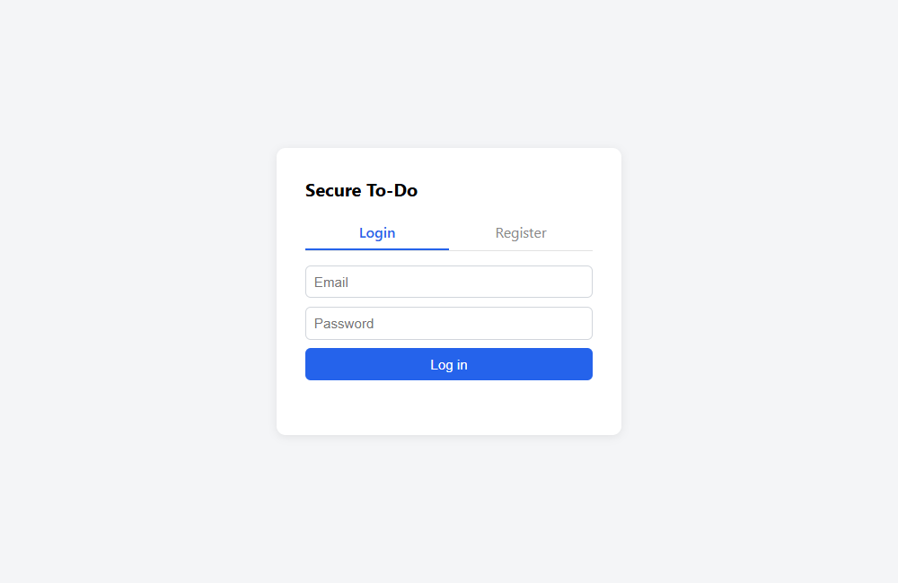
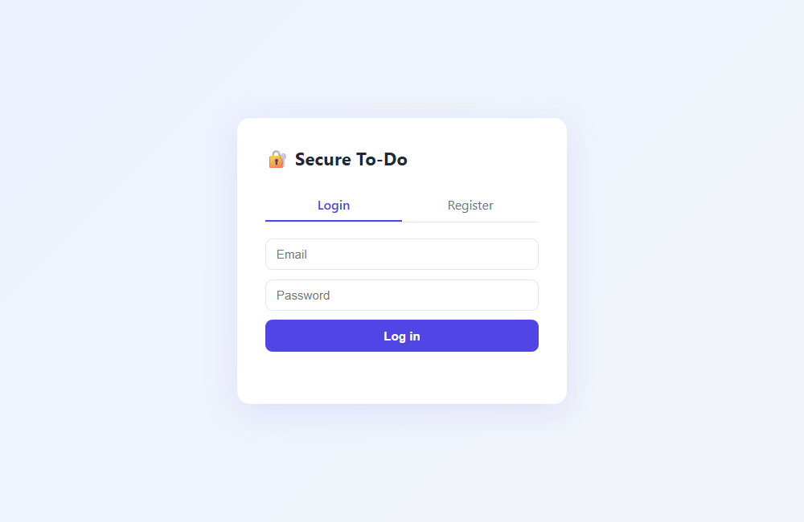
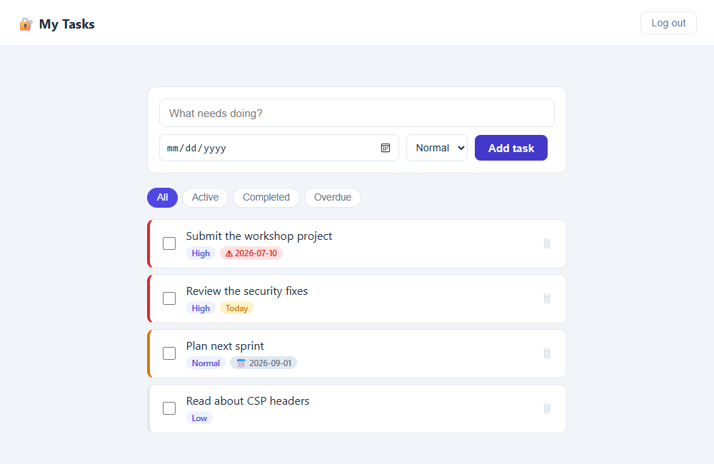

# Team:
-Abdulaziz Mulia
-Feras Al-Harbi
-Faisal Al-Abdul-Jabbar

# 🔐 Secure To-Do App — تطبيق مهام آمن

> Built for the **SDAIA Vibe Coding workshop** (البرمجة التوليدية) — a simple
> personal task manager whose real goal is applying the full security +
> discipline cycle: a rules file ([CLAUDE.md](CLAUDE.md)), strict test-first
> TDD, and a documented security review with real fixes.
>
> تطبيق مهام شخصي بسيط، هدفه الحقيقي تطبيق دورة الانضباط الكاملة: ملف قواعد،
> اختبارات تُكتب قبل الكود، ومراجعة أمنية اكتشفت ثغرتين حقيقيتين وأصلحتهما.

## 🎬 Demo — تجربة حية

The full journey: register → log in → add tasks → complete → delete → log out.



| Login / Register | My Tasks dashboard |
|---|---|
|  |  |

## ✨ Features

- **Auth:** register & login with email + password (bcrypt-hashed, never plain text)
- **Rate limiting:** 5 failed logins → temporary 15-minute lock (HTTP 429)
- **Task CRUD:** add, list, inline-edit (click the title), complete, delete (with confirm)
- **Due dates & priority:** each task has an optional due date and a priority
  (low / normal / high). The list auto-sorts (active first → higher priority →
  earliest due date) and shows coloured badges: red = overdue, amber = today,
  grey = upcoming
- **Filters:** view All / Active / Completed / Overdue
- **Ownership everywhere (no IDOR):** every task query is scoped to the logged-in
  user — someone else's task id answers `404` as if it doesn't exist
- **CSRF protection:** state-changing requests require a per-session token;
  session cookie is `SameSite=Lax` + `HttpOnly`
- **Validation:** task title required, ≤ 200 chars, HTML rejected before it
  ever reaches the database (no stored XSS); due date must be valid ISO,
  priority must be 1–3
- **Generic errors:** no stack traces, no DB details, no account enumeration

## 🛡️ Security

The Step-8 security review found **7 vulnerabilities** (2 High, 3 Medium, 2 Low)
and **fixed every one** — each proved with a failing test first — documented in
**[SECURITY.md](SECURITY.md)**. The two most serious:

1. **Permanent account lockout (DoS)** — an attacker who knew only your email
   could lock you out *forever*. Now the lock expires after 15 minutes.
   (commit `a89fa82`)
2. **No CSRF protection** — a forged cross-site request used to return
   `201 Created`; now it gets `403`. (commit `06a27c2`)

## 🧪 TDD — tests always came first

Every feature followed **RED → GREEN → REFACTOR**, and the git history proves
it: the first commit contains the failing test suite and *no* `app.py` at all.

| Phase | Commit | What happened |
|---|---|---|
| RED | `e676de5` | Auth tests written first — bcrypt storage, SQL-injection rejection, rate limiting. All failing: no implementation exists |
| GREEN | `31a466d` | Minimum Flask code turns the suite green (plus a real Windows file-lock bug found & root-caused on the way) |
| RED→GREEN | `fe4c66e` | Task CRUD: 14 tests first (IDOR, validation, auth-wall), then the routes |
| Fix 1 | `a89fa82` | Lockout-expiry tests first, then the fix |
| Fix 2 | `06a27c2` | 6 CSRF tests first, then the protection |
| RED (only) | `7fafc25` | Due-date + priority tests committed **alone**, no implementation — pure proof tests came first |
| GREEN | `e50dbf4` | The implementation that turns `7fafc25` green |

**52 tests** cover the happy paths *and* the attacks: SQL injection payloads,
`DROP TABLE` survival, a user probing another user's task ids, forged
requests without CSRF tokens, the exact rate-limit threshold (4 failures
fine, 5 locked, unlocked again after the window), password/email validation,
timing-safe login, and due-date/priority ordering.

## 🚀 Getting started

```bash
git clone https://github.com/AK7Amin/SDAIA-VIBECODING-TO-DO-APP-PROJECT.git
cd SDAIA-VIBECODING-TO-DO-APP-PROJECT

python -m venv .venv
.venv\Scripts\activate          # Windows  (Linux/Mac: source .venv/bin/activate)
pip install -r requirements.txt

copy .env.example .env          # then EDIT .env: set a long random SECRET_KEY
python app.py                   # → http://127.0.0.1:5000
```

> The app **refuses to start** without a `SECRET_KEY` — secrets live in the
> git-ignored `.env`, never in code. That's rule #1 of [CLAUDE.md](CLAUDE.md).

### Run the tests

```bash
python -m pytest tests -v
```

### Regenerate the README media (optional)

```bash
pip install playwright pillow
python scripts/make_demo_media.py   # uses your installed Edge, headless
```

## 📁 Project structure

```
├── CLAUDE.md              # the rules file — written BEFORE any code
├── PRD Claude.md          # one-page product requirements
├── PLAN.md                # phase-2 roadmap (security, features, UI)
├── SECURITY.md            # security review: 7 findings, all fixed
├── app.py                 # Flask app: auth + task CRUD + pages
├── templates/
│   ├── login.html         # login / register page
│   └── dashboard.html     # task dashboard (badges, filters)
├── tests/
│   ├── conftest.py        # fresh app + throwaway DB per test
│   ├── test_auth.py       # bcrypt, SQL injection, rate limit, lockout, pw/email/timing
│   ├── test_tasks.py      # CRUD, validation, IDOR protection
│   ├── test_task_fields.py # due dates, priority, ordering
│   ├── test_csrf.py       # CSRF rejection/acceptance, cookie flags
│   └── test_headers.py    # security headers on every response
└── scripts/
    └── make_demo_media.py # generates docs/ screenshots + demo.gif
```

## 🎓 Workshop rubric (slide 90)

| # | Requirement | Status |
|---|---|---|
| 1 | Rules file actually applied | ✅ [CLAUDE.md](CLAUDE.md) in the repo root before the first line of code, enforced throughout |
| 2 | At least one test written before its code | ✅ *Every* test — commit `e676de5` is tests-only, no app |
| 3 | One vulnerability documented & fixed | ✅ Two of them — see [SECURITY.md](SECURITY.md) |
| 4 | Zero hardcoded secrets | ✅ `.env` (git-ignored) + startup guard |

---

*Stack: Python / Flask / SQLite / pytest / bcrypt — kept deliberately simple for the workshop.*
